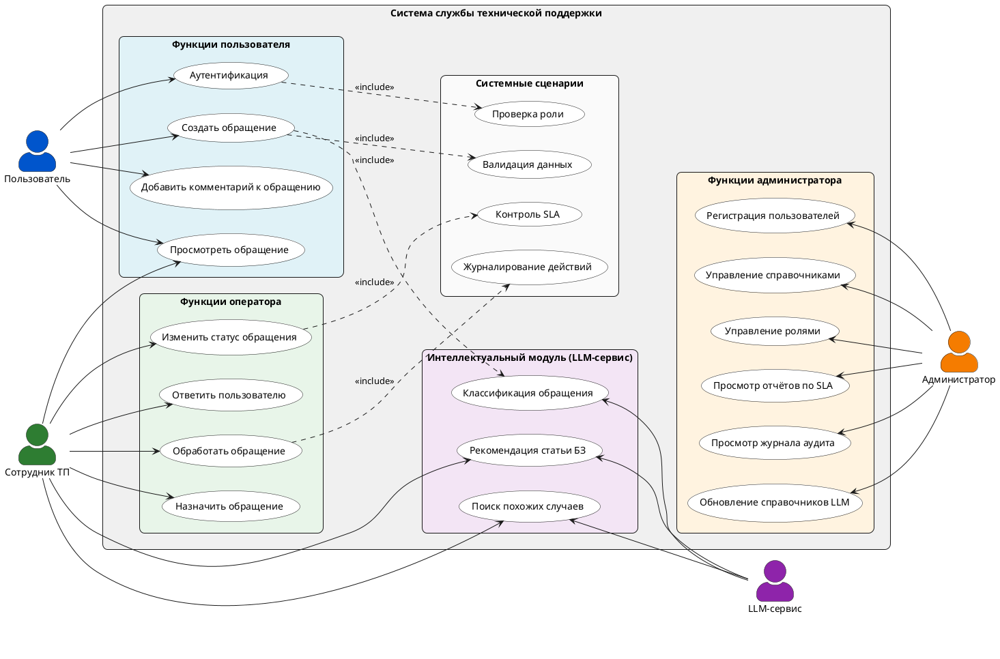

# UML (PlantUML)

```plantuml
@startuml
left to right direction
skinparam packageStyle rectangle
skinparam shadowing false
skinparam roundcorner 15
skinparam actorStyle awesome

' ------------------ АКТОРЫ ------------------
actor "Пользователь" as User #0055CC
actor "Сотрудник ТП" as Operator #2E7D32
actor "Администратор" as Admin #F57C00
actor "LLM-сервис" as LLM #8E24AA

' ------------------ ГРАНИЦА СИСТЕМЫ ------------------
rectangle "Система службы технической поддержки" #F0F0F0 {

    ' ------------------ ПАКЕТЫ USE CASE ------------------
    rectangle "Функции пользователя" #E0F2F7 {
        (Аутентификация) #FFFFFF
        (Создать обращение) #FFFFFF
        (Просмотреть обращение) #FFFFFF
        (Добавить комментарий к обращению) #FFFFFF
    }

    rectangle "Функции оператора" #E8F5E9 {
        (Обработать обращение) #FFFFFF
        (Просмотреть обращение) #FFFFFF
        (Назначить обращение) #FFFFFF
        (Изменить статус обращения) #FFFFFF
        (Ответить пользователю) #FFFFFF

    }

    rectangle "Функции администратора" #FFF3E0 {
        (Регистрация пользователей) #FFFFFF
        (Управление справочниками) #FFFFFF
        (Управление ролями) #FFFFFF
        (Просмотр отчётов по SLA) #FFFFFF
        (Просмотр журнала аудита) #FFFFFF
        (Обновление справочников LLM) #FFFFFF
    }

    rectangle "Интеллектуальный модуль (LLM-сервис)" #F3E5F5 {
        (Классификация обращения) #FFFFFF
        (Рекомендация статьи БЗ) #FFFFFF
        (Поиск похожих случаев) #FFFFFF
    }

    rectangle "Системные сценарии" #FAFAFA {
        (Проверка роли) #FFFFFF
        (Журналирование действий) #FFFFFF
        (Валидация данных) #FFFFFF
        (Контроль SLA) #FFFFFF
    }

}

' ------------------ СВЯЗИ АКТОРОВ ------------------
' Пользователь
User --> (Аутентификация)
User --> (Создать обращение)
User --> (Просмотреть обращение)
User --> (Добавить комментарий к обращению)

' Оператор
Operator --> (Обработать обращение)
Operator -->(Назначить обращение) 
Operator -->(Изменить статус обращения) 
Operator -->(Ответить пользователю) 
Operator --> (Просмотреть обращение)
Operator --> (Рекомендация статьи БЗ)
Operator --> (Поиск похожих случаев)

' Администратор
(Регистрация пользователей) <-- Admin 
(Управление справочниками) <-- Admin 
(Управление ролями) <-- Admin 
(Просмотр отчётов по SLA) <-- Admin 
(Просмотр журнала аудита) <-- Admin 
(Обновление справочников LLM) <-- Admin 

' LLM-сервис
(Классификация обращения) <-[norank]- LLM
(Рекомендация статьи БЗ) <-[norank]- LLM
(Поиск похожих случаев) <-- LLM

' ------------------ ВЗАИМОДЕЙСТВИЯ ------------------
' Всегда выполняемые сценарии
(Создать обращение) .-> (Классификация обращения) : <<include>>

' Обработать обращение


' Системные сценарии
(Аутентификация) .-> (Проверка роли) : <<include>>
(Создать обращение) .-> (Валидация данных) : <<include>>
(Обработать обращение) .-> (Журналирование действий) : <<include>>
(Изменить статус обращения) .-> (Контроль SLA) : <<include>>

' ------------------ Скрытые линии для выравнивания ------------------
(Поиск похожих случаев) -[hidden]- (Управление справочниками)
@enduml
```
